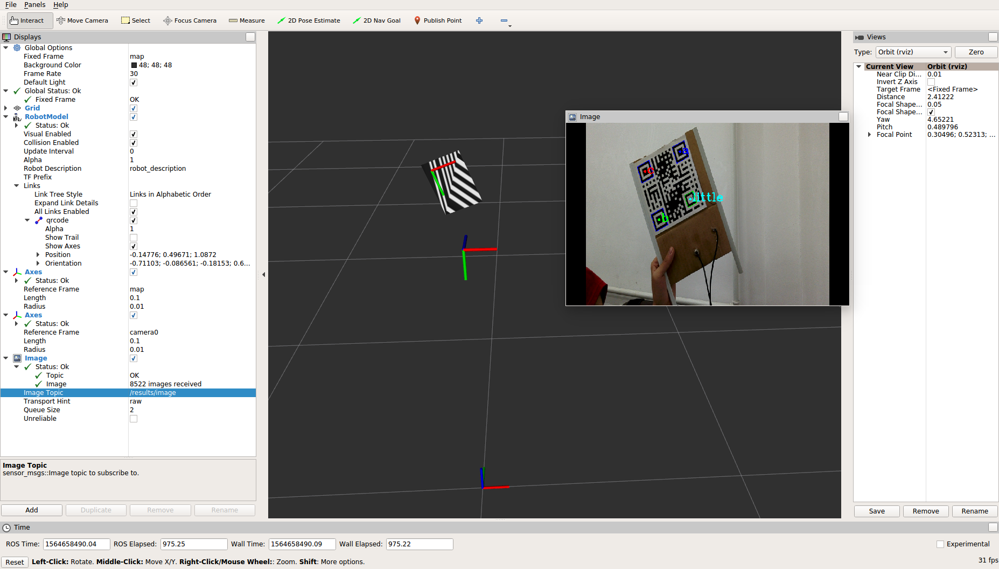

# using line laser scan objects

easyscan NOT easy

## Part 1 using ros
### Calibrate the camera
Use ros package camera_calibration to get the camera intrinsic parameters. And the details can be found [here](http://wiki.ros.org/camera_calibration/Tutorials/MonocularCalibration). The calibration boards can found here [chessboard](./files/chessboard.pdf), [laser_plane](./files/laser_calibration(8x3)_20mm.pdf) 
1. calibrate the first camera
```roslaunch easyscan calibrate_camera0.launch```

2. calibrate the second camera
```roslaunch easyscan calibrate_camera1.launch```

Move the calibration results to folder `config`, and named the two yaml files as `ost0.yaml` and `ost1.yaml`.


When the calibration of camera0 was done, you can use
```roslaunch easyscan nvidia_camera.launch```
to see the QRcode like this.
 

3. calibrate the laser plane and camera

*Reference: Fast method to calibrate structure parameters of line structured light vision sensor*

Use this command to calibrate the laser and camera
```roslaunch easy calibrate_laser_plane.launch```
The calibration results will be saved in file `config/laser_plane.yaml`
It will save three parameters, theta0, theta1, theta2, which represented the laser plane equation in camera1 coordintate system.

4. calibrate the transform matrix between camera1 and the QR_code (Optional)
If you did not need the transform matrix, the coordinate systems are set to the same. 

In this step, we use the camera0 to assist the calibration, and we should use the keyboard to interacte with the program. 
* First, run the command
```roslaunch easyscan calibrate_camera1_QRcode.launch```
You can use this to see the results during the calibration.
```rqt_image_view results/calibrate_camera_QRcode```

* Second, put the chessboard board in the visual field of the camera0. You should thoose a position which is easy to localize the chessboard for camera0. Such as put the field center of the camera0. After the chessboard was solidly in place. You should press `Enter` to start the localization. Later, the ROS info will show the chessboard is localized, and the program has gotten the transform matrix between camera0 and the chessboard. 

* Third, when the ROS info shows that the second step has finished you should put the QRcode with the camera1 and laser between the camera0 and the chessboard. We should use camera0 to localize the QRcode and use the camera1 to localize the chessboard. You must place the QRcode perfect that the QRcode should in the visual field of camera0, and the chessboard should in the visual field of camera1. And when you put them well, you should press `Enter` to start the localization. The program will get two transform matrices of camera0 and QRcode, and camera1 and the chessboard.

* After the three step, the program will calculate the transform matrix between camera1 and the QRcode. And the calibration results will save in `config/camer1_QRcode.yaml`. 


## Part 2 no ros


